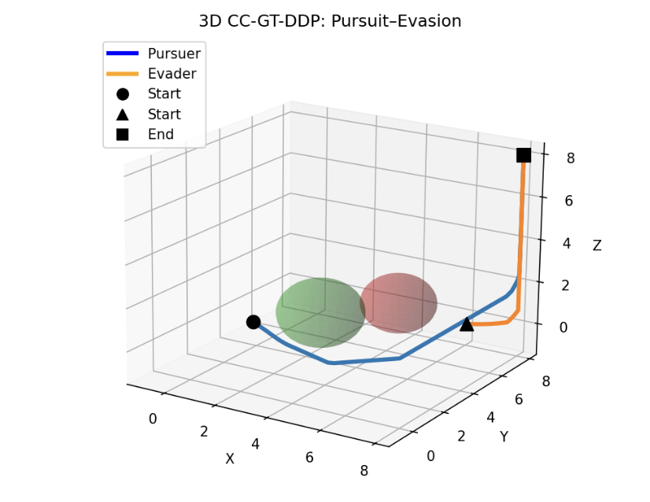
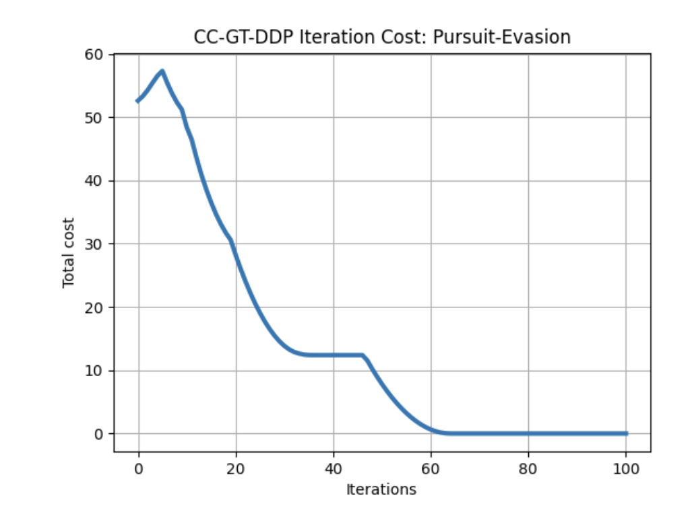

# Safe Min-Max DDP — 3D Pursuit-Evasion Game

Implementation of **Chance Constrained Min-Max Differential Dynamic Programming (Safe Min-Max DDP)** applied to a **Pursuit-Evasion Game between two Quadrotors (UAVs)** system.

## 📖 Description
Chance Constrained Min-Max DDP is applied to two quadrotors for pursuit-evasion game to compute optimal control trajectories in presence of obstacles. This example demonstrates the robustness and safety of Min-Max DDP compared to standard DDP when disturbances are present in the system dynamics.

## 📊 Results

## 🎥 Video
[▶️ Click here to watch the implementation video](video.mp4)

## 🚀 How to Run
1. Open Python
2. Navigate to this folder
3. Run the main `.py` file
